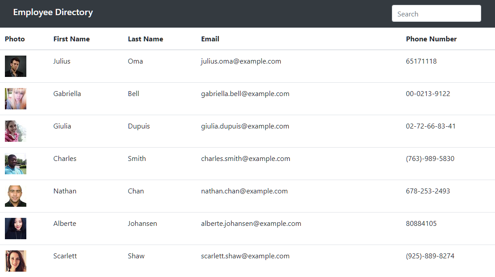

# Employee Directory 

[Original Repo](https://github.com/tjvig94/employee-directory/)

[Deployed Application](https://tjvig94.github.io/employee-directory2/)

I really goofed up my repo on this one... You'll have to look back in the commit history over there to see the progress on the development. Sorry!

## Table of Contents
 - [Description](#description)
 - [Usage](#Usage)
 - [Technology](#Technology)
 - [License](#license)
 - [Questions](#questions)

## Description
This is a SPA for managers to view basic information about employees, and to search for employee data. Managers can view employee photos, names, email addresses, and phone numbers.
    
## Usage
Type in the search bar to begin filtering employees by name. The search bar looks for last names and first names.
    
## Technology
This application was built using React, along with Bootstrap for styling. 

## License (MIT)
Copyright 2021, Tim Vigneau 

Permission is hereby granted, free of charge, to any person obtaining a copy of this software and associated documentation files (the "Software"), to deal in the Software without restriction, including without limitation the rights to use, copy, modify, merge, publish, distribute, sublicense, and/or sell copies of the Software, and to permit persons to whom the Software is furnished to do so, subject to the following conditions:
        
The above copyright notice and this permission notice shall be included in all copies or substantial portions of the Software.
        
THE SOFTWARE IS PROVIDED "AS IS", WITHOUT WARRANTY OF ANY KIND, EXPRESS OR IMPLIED, INCLUDING BUT NOT LIMITED TO THE WARRANTIES OF MERCHANTABILITY, FITNESS FOR A PARTICULAR PURPOSE AND NONINFRINGEMENT. IN NO EVENT SHALL THE AUTHORS OR COPYRIGHT HOLDERS BE LIABLE FOR ANY CLAIM, DAMAGES OR OTHER LIABILITY, WHETHER IN AN ACTION OF CONTRACT, TORT OR OTHERWISE, ARISING FROM, OUT OF OR IN CONNECTION WITH THE SOFTWARE OR THE USE OR OTHER DEALINGS IN THE SOFTWARE.

## Questions
Github: [tjvig94](https://github.com/tjvig94)
Email: tjvig94@gmail.com
